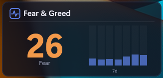

# Fear & Greed Index – Rainmeter Skin
  
  A modern glassmorphism Rainmeter skin that displays the **Crypto Fear & Greed Index** with a 7-day history bar chart.
  ## Features
  - Real-time Fear & Greed Index from [Alternative.me](https://alternative.me/crypto/fear-and-greed-index/)
  - Dynamic color-coded value (red → orange → green)
  - 7-day history bar chart
  - Sentiment classification label
  - Live clock
  ## Requirements
  - [Rainmeter 4.0+](https://www.rainmeter.net/)
  - Fonts: Segoe UI Variable, Segoe Fluent Icons, Cascadia Code (included with Windows 11)
  - Internet connection
  
  ## Easy Installation
  Just download FearAndGreed_v1.rmskin file and double click it.
  
  ## Manual Installation
  1. Download or clone this repo
  2. Copy the `FearGreed` folder to `Documents\Rainmeter\Skins\`
  3. Right-click the Rainmeter tray icon → **Manage Skins**
  4. Navigate to `FearGreed\FearGreed.ini` → **Load**
  
  
  ## Configuration
  Edit the `[Variables]` section in `FearGreed.ini`:
  | Variable | Default | Description |
  |----------|---------|-------------|
  | `PanelColor` | `20,20,30,210` | Background RGBA |
  | `AccentColor` | `100,140,255` | Accent color for bars/highlights |
  | `CardRadius` | `12` | Corner roundness |
  ## API
  Data from [Alternative.me Crypto Fear & Greed Index](https://alternative.me/crypto/fear-and-greed-index/).
  Free, no API key required. Updates every 10 minutes.
  ## License
  CC BY-NC-SA 3.0
